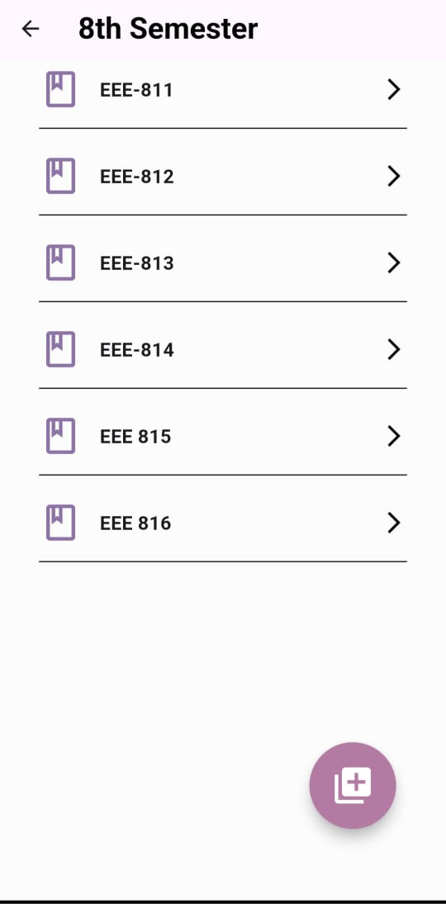

# Examiner App

The **Examiner** app is part of the Examiner project developed for the Department of Electrical and Electronic Engineering, University of Chittagong. This app is designed to facilitate the management of exams, student allocation, and attendance through the use of facial recognition technology. Teachers can create courses, schedule exams, acquire student information, and take attendance securely and efficiently using the app.

## Features

1. **Courses:**
    - Teachers can add new courses for each semester, ensuring that students are assigned to the correct courses for the respective semester.

2. **Exams:**
    - Teachers can create exams by selecting the course, setting an exam date, and choosing the room where the exam will take place. This simplifies exam scheduling and room allocation.

3. **Examinees:**
    - Teachers can retrieve students from a specific semester by entering a range of roll numbers. Additionally, if information about a student outside the range or semester is needed, they can input the roll number directly to fetch that student's details.

4. **Attendance:**
    - Once the list of students for an exam is acquired, the attendance process begins. Each student faces the camera, and the captured image is pre-processed and passed into the FaceNet Lite model, which generates face embeddings. These embeddings are compared with the embeddings stored in the database using the Euclidean distance algorithm to identify the student.

5. **Attendance Confirmation:**
    - To minimize errors, the system requires students to confirm their attendance. If the Euclidean distance between the live embeddings and the stored embeddings is below a predefined threshold, the student’s details are shown on the screen. The student can then confirm if the match is correct, or reject it in case of a false recognition. Upon confirmation, their attendance is saved in the database and displayed on the screen.

## Screenshots

<table>
  <tr>
    <td style="text-align:center">
      
      
Home

    </td>
    <td style="text-align:center">
      
      
Courses

    </td>
  </tr>
  <tr>
    <td style="text-align:center">
      
      
Exams

    </td>
    <td style="text-align:center">
      
      
Live Feed

    </td>
  </tr>

  <tr>
   <td style="text-align:center">
      
      
Attendance Confirmation

    </td>
    <td style="text-align:center">
      
      
Attended Students

    </td>
  </tr>
</table>

## Technologies Used

- **TensorFlow Lite (FaceNet):**  
  TensorFlow Lite is a lightweight version of TensorFlow optimized for mobile and embedded devices. It runs the FaceNet model for generating face embeddings based on the live feed image of students. These embeddings uniquely represent a student's face and are compared against stored embeddings to recognize the student. The entire facial recognition process happens locally on the device for optimal performance.

- **Django:**  
  Django is a high-level Python web framework used as the backend for the Examiner app. It handles API requests for student data, exam scheduling, and attendance. The Django REST framework enables secure communication between the mobile app and the backend, managing data storage and retrieval in the MySQL database.

- **MySQL:**  
  MySQL is a relational database system that stores student information, course and exam details, and face embeddings. It ensures efficient data retrieval and management, allowing quick access to the necessary information during the attendance process.

## References
- [FaceNet Paper](https://www.cv-foundation.org/openaccess/content_cvpr_2015/papers/Schroff_FaceNet_A_Unified_2015_CVPR_paper.pdf)

